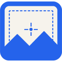

# Longshot

Full-page screenshots in the browser, then crop, annotate, copy, download, or
save as PDF. Captures stay on your machine.

<p>
  
</p>

**Studio:** [longshot-seven.vercel.app](https://longshot-seven.vercel.app)

## What it does

- Full page, visible viewport, or drag-to-select an area
- Sticky headers hidden after the first tile so they are not repeated
- Editor: crop, pen, shapes, text, stamps, undo/redo
- Export PNG, JPEG, WebP, AVIF, or PDF
- Files page for recent captures
- Optional one-click toolbar capture (off by default)

## Install the extension (unpacked)

Chrome Web Store listing is not published yet. Sideload it:

1. Clone this repo, or download `public/longshot-extension.zip` from the
   [studio install page](https://longshot-seven.vercel.app/install) and unzip it.
2. Open `chrome://extensions` or `brave://extensions`.
3. Turn on Developer mode.
4. Load unpacked and choose the `extension/` folder (or the unzipped
   `longshot-extension` folder).

Right-click the toolbar icon → **Options** for format, folder, and one-click
capture. If one-click is on, the icon starts a capture instead of opening the
menu.

## Studio

```
npm install
npm run dev
```

The studio is for editing and trying sample pages. Capturing a live website
needs the extension.

## Privacy

See [PRIVACY.md](PRIVACY.md). Screenshots are not uploaded. Feedback you send
from the editor goes only to the maintainer.

## License

[MIT](LICENSE)
